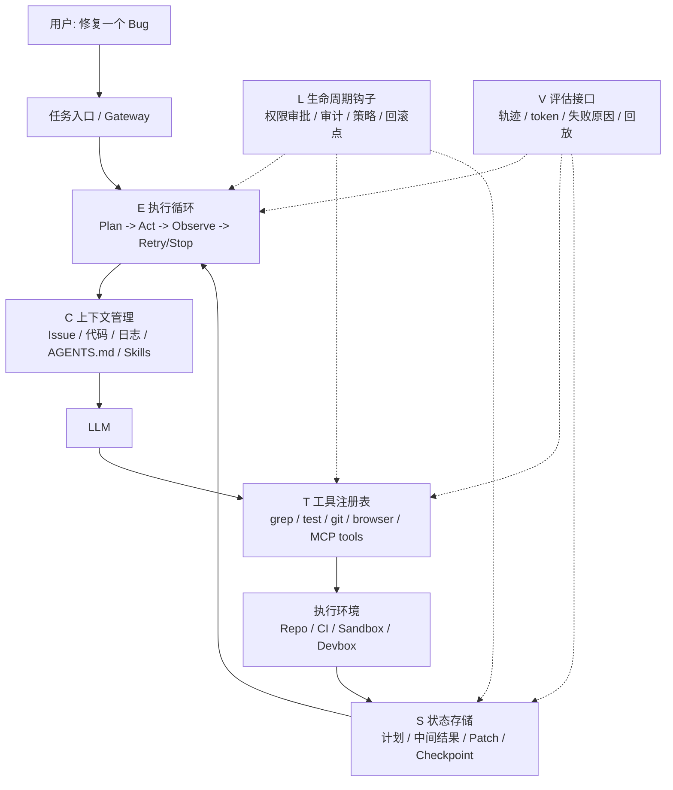
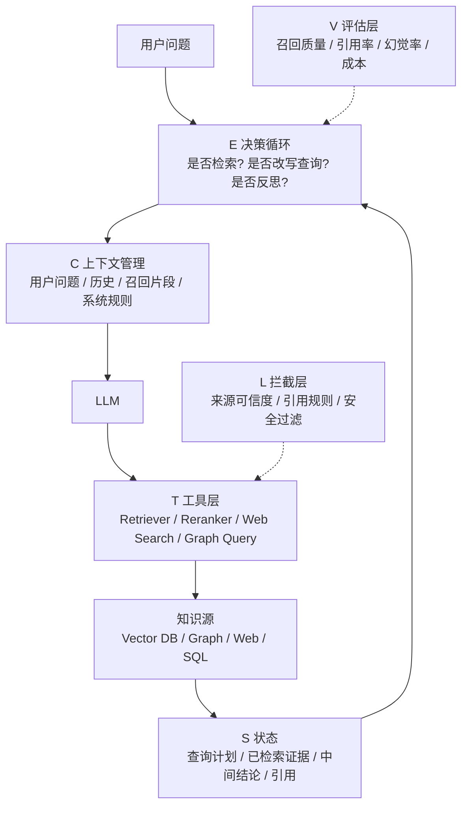

# Harness 实战架构版

> 基于 `harness-agent.pdf` 的六组件框架，结合 MCP、A2A、Codex、Anthropic、Vercel 等公开资料，面向落地实践的学习稿。

---

## 1. 先记住一句话

```text
Agent = Model + Harness
```

这里的 **Harness** 不是“附属配置”，而是决定 Agent 能不能在真实环境里稳定工作的**运行时基础设施**。

如果只换模型，不换 Harness，系统可能还是不稳。
如果模型不变，但 Harness 设计得更合理，系统性能经常会明显提升。

---

## 2. 六组件总览

```text
H = (E, T, C, S, L, V)

E = Execution Loop     执行循环
T = Tool Registry      工具注册表
C = Context Manager    上下文管理
S = State Store        状态存储
L = Lifecycle Hooks    生命周期钩子
V = Evaluation         评估/观测接口
```

### 2.1 一眼看懂

| 组件 | 它负责什么 | 没做好会怎样 |
|------|-----------|-------------|
| **E** | 决定 agent 如何一轮轮执行、停止、重试、恢复 | 死循环、乱重试、跑飞 |
| **T** | 决定 agent 能用哪些工具、怎么调用、权限多大 | 调错工具、越权、工具太多反而变笨 |
| **C** | 决定每轮给模型看什么 | 上下文膨胀、看错重点、信息污染 |
| **S** | 保存计划、记忆、阶段结果、恢复点 | 中途断了就失忆，跨轮不连续 |
| **L** | 在关键动作前后做拦截、审计、策略控制 | 风险动作没人管，副作用不可控 |
| **V** | 记录轨迹、成本、成功率、失败原因 | 看不见问题，无法优化 |

### 2.2 最小可用条件

- 至少有 `E + T`，才能算一个“能行动的 agent harness”
- 六个组件都比较完整，才更接近生产级系统

---

## 3. 用一个 Coding Agent 看懂 Harness

这是最典型、也最容易理解的场景。

### 3.1 架构图



### 3.2 一次真实执行到底发生了什么

#### 第 1 步：接任务

用户说：“修复支付回调重复写入的问题。”

Harness 不会直接把这句话丢给模型，而是会先做三件事：

1. 确定任务边界
2. 收集当前 repo 的关键上下文
3. 决定允许模型接触哪些工具和环境

这时候主要是 `C + T + L` 在工作。

#### 第 2 步：建立执行循环

`E` 会决定流程：

```text
读取 Issue
  -> 搜索相关代码
  -> 看测试和日志
  -> 生成修改方案
  -> 修改代码
  -> 运行测试
  -> 失败则回退到上一步
  -> 成功则产出补丁
```

注意：这不是 prompt，而是**运行时控制逻辑**。

#### 第 3 步：模型并不是“自由行动”

模型想做任何事，都要通过 `T`：

- 读文件：`grep` / `cat` / `ls`
- 跑测试：`pytest` / `go test` / `npm test`
- 调浏览器：DevTools 或浏览器自动化接口
- 查平台文档：MCP server 或内置检索工具

也就是说：

```text
模型不会直接操作世界
模型只能通过 Harness 暴露的工具去操作世界
```

#### 第 4 步：为什么需要状态存储

如果这个任务持续 20 分钟，agent 会产生很多中间状态：

- 已读过哪些文件
- 已尝试过哪些修复方案
- 哪次测试失败，为什么失败
- 当前 patch 到了哪个版本
- 是否已经请求过人工审批

这些都属于 `S`

如果没有 `S`，agent 每一轮都像“重开新对话”。

#### 第 5 步：为什么需要生命周期钩子

不是每个动作都应该无条件执行。

例如：

- 执行 `rm -rf` 前必须拦截
- 推送代码前必须经过 policy
- 修改生产配置前必须人工确认
- 写长期记忆前必须做内容校验

这就是 `L`

可以把它理解成：

```text
L = 安检 + 审计 + 策略引擎
```

#### 第 6 步：为什么评估接口很关键

最后不仅要知道“成没成功”，还要知道：

- 总共走了几轮
- 哪一轮开始偏航
- 哪个工具最常导致失败
- token 花在哪
- 是上下文问题、工具问题，还是规划问题

这就是 `V`

很多系统有日志，但没有真正的 `V`。

日志告诉你“做过什么”。
`V` 告诉你“为什么成/为什么败、能不能比较、能不能复盘”。

---

## 4. 把 Coding Agent 映射到现实系统

### 4.1 MCP 在哪里

MCP 更接近 `T` 层。

它解决的是：

- tool 怎么暴露
- schema 怎么描述
- client 怎么调用
- server 怎么协商能力

所以可以简单记：

```text
MCP = Tool 接口标准化
```

适合：

- 一个 agent 访问很多外部工具
- 不同团队想复用工具，而不是每次手写集成

### 4.2 A2A 在哪里

A2A 更接近多 agent 场景下 `E` 的外延。

它解决的是：

- agent 怎么暴露自己能力
- agent 怎么向另一个 agent 委派任务
- 长任务怎么流式返回进度

所以可以简单记：

```text
A2A = Agent 之间的任务委派协议
```

适合：

- Research Agent 把子任务交给 Search Agent
- Gateway Agent 把问题转给专门的 RAG Agent

### 4.3 AGENTS.md / Skills / Repo 文档属于哪里

主要属于 `C`

因为它们是在帮助 Harness 决定：

- 什么信息该进上下文
- 以什么结构进上下文
- 什么是优先级高的知识

OpenAI 的 Codex 工程实践很强调一点：

```text
Agent 看不见的知识，对它来说就等于不存在
```

所以把知识沉淀到 repo 内、版本化、结构化，本质是在增强 `C`。

### 4.4 Sandbox / Devbox / MicroVM 属于哪里

主要属于 `E + L`

- `E` 负责实际运行环境
- `L` 负责权限、隔离、批准、审计

如果 agent 能执行代码，但没有隔离环境，它就不是“高自主”，而是“高风险”。

---

## 5. 再用一个 Agentic RAG 看懂 Harness

前面的 Coding Agent 偏“改代码”。
下面这个更贴近你当前资料库的主题。

### 5.1 架构图



### 5.2 为什么 RAG 也离不开 Harness

很多人以为 RAG 就是：

```text
检索 -> 拼接 -> 生成
```

这只是最基础的一层。

真正能用的 Agentic RAG，更像这样：

```text
收到问题
  -> 判断是否需要检索
  -> 如果需要，先改写查询
  -> 先查内部知识库
  -> 不够再查 Web
  -> 对证据做筛选/重排
  -> 发现证据矛盾则继续追问
  -> 最后生成带引用答案
  -> 再检查答案是否被证据支持
```

你会发现，这里每一块都落在六组件里。

### 5.3 六组件在 RAG 里的具体落点

| 组件 | 在 Agentic RAG 里的体现 |
|------|-------------------------|
| **E** | 是否重写查询、是否补检索、是否切换到 web、是否结束 |
| **T** | Retriever、Reranker、SQL、Graph、Web Search、Citation Tool |
| **C** | 哪些证据进上下文，按什么顺序进，是否摘要后再注入 |
| **S** | 已召回证据、失败检索记录、引用链、中间结论 |
| **L** | 来源可信度校验、敏感站点限制、引用规范检查 |
| **V** | 召回率、引用覆盖率、答案真实性、步骤成本 |

---

## 6. 同样是 Agent，为什么有的系统“看着很聪明，却老翻车”

最常见不是模型智商不够，而是 Harness 设计有坑。

### 6.1 坑一：工具太多

表面上像是“能力更强”，实际上经常会：

- 让模型选错工具
- 让 prompt/tool schema 膨胀
- 增加搜索空间
- 增加失败路径

Vercel 的工程经验很有代表性：

- 他们把大量专用工具删掉后
- 让 agent 主要通过文件系统和命令行理解上下文
- 成功率、速度、token 消耗都变好了

这说明：

```text
T 不是越大越强
T 要“够用且清晰”
```

### 6.2 坑二：长上下文就以为不用管 C

不对。

长上下文只是在“容量”上变大，不代表“注意力”变好了。

真正的问题变成：

- 哪些信息最该被放到显眼位置
- 哪些内容应该重复注入
- 哪些历史应该压缩为状态摘要

也就是：

```text
短上下文时代：重点是保留
长上下文时代：重点是突显
```

### 6.3 坑三：只有日志，没有评估接口

很多团队会说：

> 我们有 trace、有 log。

但如果你回答不了下面这些问题，就说明 `V` 仍然薄弱：

- 同一个任务失败的主因是什么
- 两种 harness 设计到底谁更优
- 某个模型升级后，是模型提升还是 harness 提升
- 哪种错误能自动恢复，哪种必须人工接管

### 6.4 坑四：把安全当成外围问题

对 agent 来说，安全不只是“输入过滤”。

真正危险的点包括：

- 检索内容带毒
- tool 输出带毒
- 长期记忆被投毒
- agent 间消息被污染
- 沙箱权限过大

所以安全要嵌入 `C/T/S/E/L`，不是单独挂一个过滤器就结束。

---

## 7. 从工程角度，怎样设计一个更稳的 Harness

这里给你一个很实用的落地模板。

### 7.1 第一层：最小闭环

```text
目标 -> 执行循环 -> 工具 -> 结果 -> 停止条件
```

你先保证：

- agent 能明确开始
- 能调用少量关键工具
- 有停止条件
- 失败后不会无限重试

这就是 `E + T` 的最小闭环。

### 7.2 第二层：把上下文收紧

```text
只给当前任务最需要的信息
不要默认塞满历史
```

实践建议：

- 把 repo 规则写进 `AGENTS.md`
- 把高频操作做成 skills / playbook
- 把工具描述压缩成任务相关版本
- 长任务用摘要状态，而不是原样堆对话

### 7.3 第三层：让状态可恢复

至少保存：

- 当前计划
- 当前阶段
- 最近一次失败原因
- 中间产物位置
- 是否需要人工批准

这样 agent 崩掉时，能从 checkpoint 恢复，而不是完全重来。

### 7.4 第四层：把策略前移

不要等模型做错了再分析。

把规则前移到 `L`：

- 危险命令审批
- 写长期记忆前验证
- 高成本工具限流
- 最多重试 N 次
- 最多进入 CI 两轮

### 7.5 第五层：把评估做成默认能力

你至少要能看：

- 任务成功率
- 平均步数
- token 成本
- 工具失败率
- 人工接管率
- 最常见失败模式

这一步是从“能跑”走向“能优化”的关键。

---

## 8. 一个可直接拿去设计系统的思考模板

以后你看任何 Agent 系统，都可以直接套这 6 个问题：

### 8.1 Execution Loop

- 它怎么开始？
- 怎么决定下一步？
- 什么情况下停止？
- 出错后是重试、回滚还是转人工？

### 8.2 Tool Registry

- 有哪些工具？
- 怎么选工具？
- 参数有没有 schema？
- 权限是否按任务收缩？

### 8.3 Context Manager

- 每轮给模型看什么？
- 历史是否摘要？
- 外部证据如何排序？
- 长上下文里如何突出重点？

### 8.4 State Store

- 保存哪些中间状态？
- 跨轮还是跨会话？
- 能不能 checkpoint 恢复？
- 长期记忆写入前有没有验证？

### 8.5 Lifecycle Hooks

- 哪些动作会被拦截？
- 是否有权限审批？
- 是否有审计日志？
- 是否支持策略注入？

### 8.6 Evaluation

- 成功怎么定义？
- 怎么做回放？
- 怎么比较不同 harness？
- 怎么定位失败主因？

---

## 9. 你现在最适合的学习路线

如果你的目标是“真正会设计 Agent 系统”，建议按这个顺序学：

### 第一步：先学“六组件”，不要先学框架

框架会变，六组件是底层抽象。

先会问：

- 这个系统的 `E/T/C/S/L/V` 分别在哪里？

### 第二步：把 MCP 和 A2A 放到正确位置

- `MCP`：工具接入标准，偏 `T`
- `A2A`：agent 间委派标准，偏多 agent 的 `E`

### 第三步：练两个 demo

#### Demo A：Coding Agent

- 只给少量工具
- 带 sandbox
- 带测试闭环
- 带失败恢复

#### Demo B：Agentic RAG

- 带 query rewrite
- 带多路检索
- 带引用校验
- 带 hallucination 检查

### 第四步：开始做评估

不要一开始只盯回答效果。

同步看：

- 步数
- 成本
- 失败原因
- 工具错误率
- 人工介入点

---

## 10. 最后用一句话收束

```text
Prompt 决定 agent 一轮怎么想，
Harness 决定 agent 整个系统怎么活。
```

当任务变长、工具变多、状态变复杂、风险变高时，
真正决定上限的，往往不是模型，而是 Harness。

---

## 参考资料

- `harness-agent.pdf`：`Agent Harness for Large Language Model Agents: A Survey`
- MCP 官方规范：<https://modelcontextprotocol.io/specification/draft/basic/index>
- MCP 授权规范：<https://modelcontextprotocol.io/specification/2025-03-26/basic/authorization>
- Google A2A 公告：<https://developers.googleblog.com/en/a2a-a-new-era-of-agent-interoperability/>
- OpenAI Codex Harness Engineering：<https://openai.com/index/harness-engineering/>
- Anthropic Building Effective Agents：<https://www.anthropic.com/engineering/building-effective-agents>
- Anthropic Demystifying Evals for AI Agents：<https://www.anthropic.com/engineering/demystifying-evals-for-ai-agents>
- Vercel 工具裁剪案例：<https://vercel.com/blog/we-removed-80-percent-of-our-agents-tools>
- Thoughtworks Harness Engineering：<https://martinfowler.com/articles/harness-engineering.html>
- METR 关于 SWE-bench 与真实合并差距：<https://metr.org/notes/2026-03-10-many-swe-bench-passing-prs-would-not-be-merged-into-main/>
